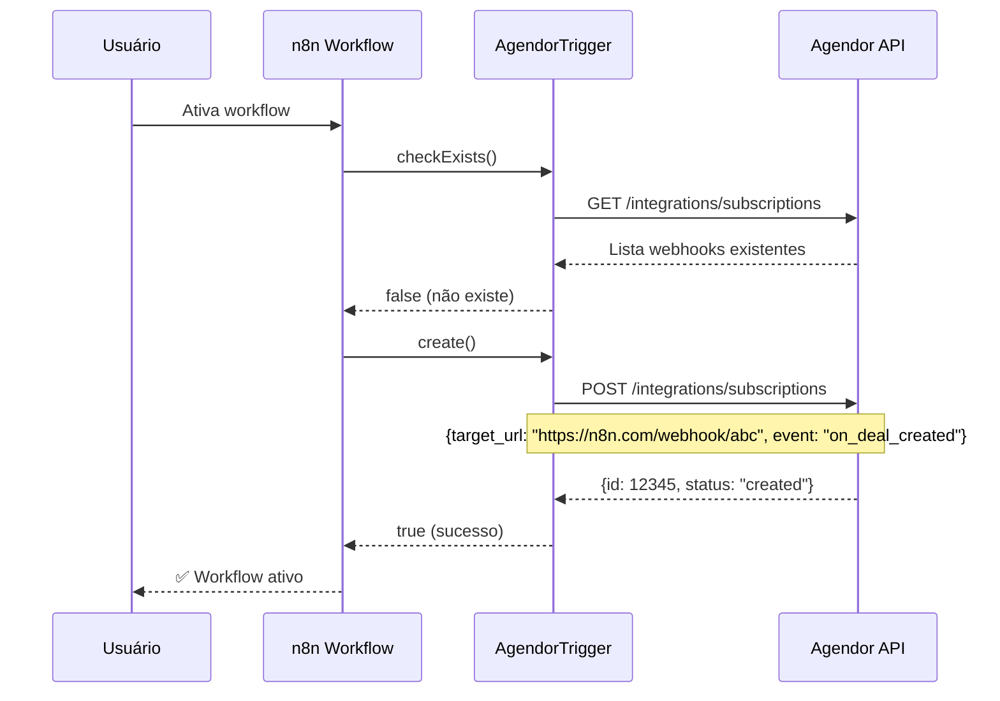
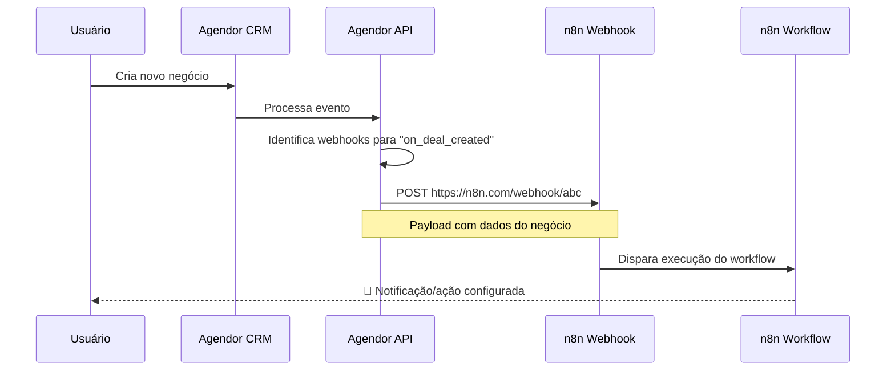

# 🔄 Fluxo Completo do Webhook Agendor + n8n

## 📋 Passo a Passo Detalhado

### **FASE 1: ATIVAÇÃO DO WORKFLOW**



### **FASE 2: EVENTO NO AGENDOR**



## 🔧 Código Real no AgendorTrigger

### **1. Verificação de Existência**
```typescript
async checkExists(this: IHookFunctions): Promise<boolean> {
    const webhookUrl = this.getNodeWebhookUrl('default');
    const event = this.getNodeParameter('event') as string;
    
    // Busca webhooks já registrados
    const response = await agendorApiRequest.call(this, 'GET', '/integrations/subscriptions');
    const webhooks = response.data || response || [];
    
    // Verifica se já existe um webhook para esta URL e evento
    for (const webhook of webhooks) {
        if (webhook.target_url === webhookUrl && webhook.event === event) {
            return true; // Já existe
        }
    }
    return false; // Não existe
}
```

### **2. Criação do Webhook**
```typescript
async create(this: IHookFunctions): Promise<boolean> {
    const webhookUrl = this.getNodeWebhookUrl('default');  // n8n gera automaticamente
    const event = this.getNodeParameter('event') as string; // evento escolhido pelo usuário
    
    const body = {
        target_url: webhookUrl,    // URL do n8n
        event: event,              // tipo de evento
        active: true               // webhook ativo
    };
    
    // AQUI ESTÁ O POST que você mencionou!
    const response = await agendorApiRequest.call(this, 'POST', '/integrations/subscriptions', body);
    
    console.log('Webhook criado:', response);
    return true;
}
```

### **3. Recebimento do Webhook**
```typescript
async webhook(this: IWebhookFunctions): Promise<IWebhookResponseData> {
    const bodyData = this.getBodyData() as IDataObject;    // Dados do evento
    const headerData = this.getHeaderData() as IDataObject; // Headers do Agendor
    
    // Processa e estrutura os dados
    const processedData = {
        event: bodyData.event || 'unknown',
        data: bodyData.data || bodyData,
        timestamp: new Date().toISOString(),
        headers: {
            'x-agendor-webhook-id': headerData['x-agendor-webhook-id'],
            'x-agendor-signature': headerData['x-agendor-signature'],
        }
    };
    
    // Retorna dados para o workflow
    return {
        workflowData: [[{ json: processedData }]]
    };
}
```

## 📡 Exemplo Real de Requisição

### **Quando você ativa o workflow, isso acontece:**

```bash
# 1. n8n gera URL única
WEBHOOK_URL="https://seu-n8n.com/webhook/6f8e9d2c-4b3a-4c7f-9e8d-2c4b3a4c7f9e"

# 2. n8n faz POST para Agendor automaticamente
curl -X POST "https://api.agendor.com.br/v3/integrations/subscriptions" \
  -H "Authorization: Token SEU_TOKEN_AGENDOR" \
  -H "Content-Type: application/json" \
  -d '{
    "target_url": "https://seu-n8n.com/webhook/6f8e9d2c-4b3a-4c7f-9e8d-2c4b3a4c7f9e",
    "event": "on_deal_created",
    "active": true
  }'

# 3. Agendor responde
{
  "id": 12345,
  "target_url": "https://seu-n8n.com/webhook/6f8e9d2c-4b3a-4c7f-9e8d-2c4b3a4c7f9e",
  "event": "on_deal_created",
  "active": true,
  "created_at": "2025-09-17T23:30:00Z"
}
```

### **Quando algo acontece no Agendor:**

```bash
# Agendor faz POST para seu n8n automaticamente
curl -X POST "https://seu-n8n.com/webhook/6f8e9d2c-4b3a-4c7f-9e8d-2c4b3a4c7f9e" \
  -H "Content-Type: application/json" \
  -H "X-Agendor-Webhook-Id: 12345" \
  -H "X-Agendor-Signature: sha256=..." \
  -d '{
    "event": "on_deal_created",
    "data": {
      "id": 67890,
      "title": "Novo Negócio",
      "value": 50000,
      "organization": {...},
      "person": {...}
    }
  }'
```

## 🔍 Debug: Como Verificar se Está Funcionando

### **1. Verificar Webhooks Registrados**
```bash
curl -X GET "https://api.agendor.com.br/v3/integrations/subscriptions" \
  -H "Authorization: Token SEU_TOKEN"
```

### **2. Ver Logs do n8n**
- Console do navegador (F12)
- Logs do servidor n8n
- Tab "Executions" no workflow

### **3. Testar Manualmente**
```bash
# Simular evento do Agendor para seu webhook
curl -X POST "https://seu-n8n.com/webhook/SUA_URL_AQUI" \
  -H "Content-Type: application/json" \
  -d '{"event": "test", "data": {"message": "teste manual"}}'
```

## ❓ Troubleshooting Comum

### **Problema**: Webhook não é criado
- ✅ **Solução**: Verificar token da API
- ✅ **Solução**: Verificar se n8n é acessível externamente

### **Problema**: Webhook criado mas não recebe dados
- ✅ **Solução**: Verificar se URL do n8n é acessível pelo Agendor
- ✅ **Solução**: Testar evento específico no Agendor

### **Problema**: Dados malformados
- ✅ **Solução**: Usar Debug Mode na v2.0.1
- ✅ **Solução**: Verificar logs detalhados

## 🎯 Resumo

1. **n8n automatiza TUDO**: Você só escolhe o evento
2. **POST é automático**: n8n faz o POST para `/integrations/subscriptions`
3. **URL é única**: n8n gera automaticamente
4. **Cleanup automático**: Quando desativa, n8n remove o webhook

**Você não precisa fazer nada manualmente - o n8n cuida de tudo!** 🚀